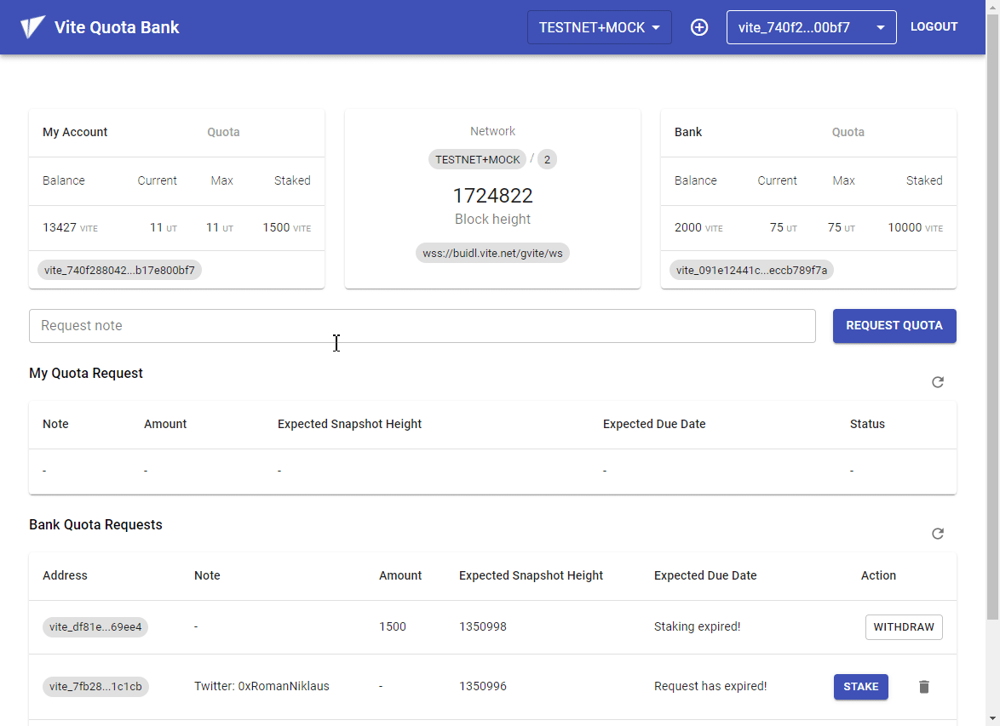

# VITE Quota Bank

Many blockchains solve the spamming problem with gas. Transactions on Vite, however, are free. To fight spamming, Vite transactions consume something called Quota. Quota can be secured by either locking VITE or running Proof-of-Work. When the Vite network is congested, locking VITE is required to secure Quota. At any time, the user can lock VITE to secure Quota for themselves or for another Vite address.

Users can lock their own VITE to secure Quota, or someone else can lock VITE to secure Quota on their behalf. For instance, if Alice doesn’t have enough VITE to lock up for getting sufficient Quota, she can ask Bob to lock his own VITE and set her address as a Quota beneficiary.

<h1 align="center">
	
</h1>

## Current limitations

This project was developed as part of the Gitcoin Grants Round 10 Hackathon taking place from Jun 16, 2021 to Jul 7, 2021. 
At that time the most recent version of `soliditypp` was `0.4.3` which has some limitations in terms of the feasability related to the submission requirements.

1. send() does not support sending tokens from one contract to another
2. contract binary size is limited to around ~11000 characters (compiled)

To overcome the mentioned limitations temporarily, the following measures have been applied/implemented:

- a mock contract to simulate the behaviour of the built-in `Quota` contract
- reduced the functionality of the `QuotaBank` contract to its bare minimum to showcase the proof-of-concept on `TestNet`
- a mock service on client-side to simulate the behaviour of functionalities currently missing by the `QuotaBank` contract

## Deploy contract

1. Modify `./scripts/constants.js`
2. Run `node ./scripts/deploy_test.js`
3. Replace `BankContractAddress` in `app/src/constants.ts`
4. Replace `QuotaBank.json` in `app/public/assets/contracts`

## Test contracts

Test QuotaBank.solpp contract:

```bash
node ./scripts/quota_bank_test.js
```

Test QuotaMock.solpp contract:

```bash
node ./scripts/quota_mock_test.js
```